<div align="center"">
    
</div>

<h1 align="center"">Interfaces com React.js</h1>

<p>Interfaces desenvolvidas para serem responsivas e intuitivas</p>

<h2>Tecnologias</h2>

- [React.js](https://react.dev/)
- [React Icons](https://react-icons.github.io/react-icons/)
- [Clique aqui para ver mais](https://github.com/FelipePinheiroRegina/frontend-titasks/blob/main/package.json)

| Tela          | Descrição                           | Imagem                         |
|---------------|-------------------------------------|--------------------------------|
| Tela de registro | cadastro de novos usuários  | 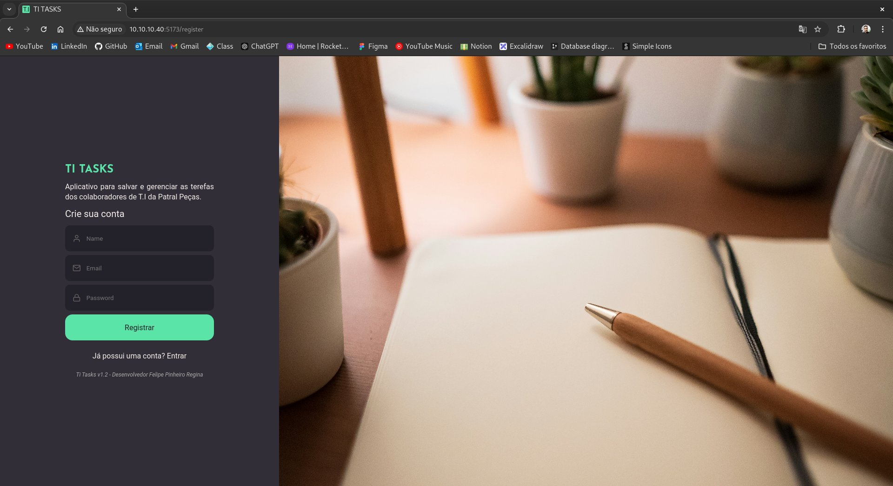  |
| Tela de login  | autenticação dos usuários | 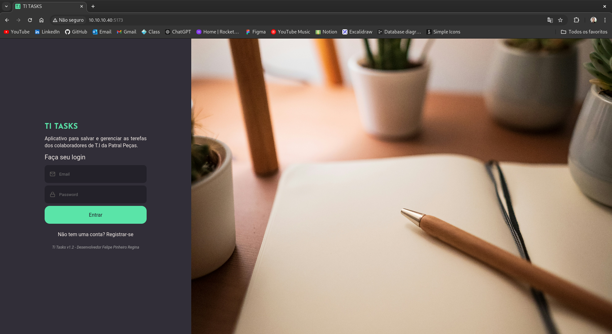 |
| Tela Home | Visualizações de tasks | 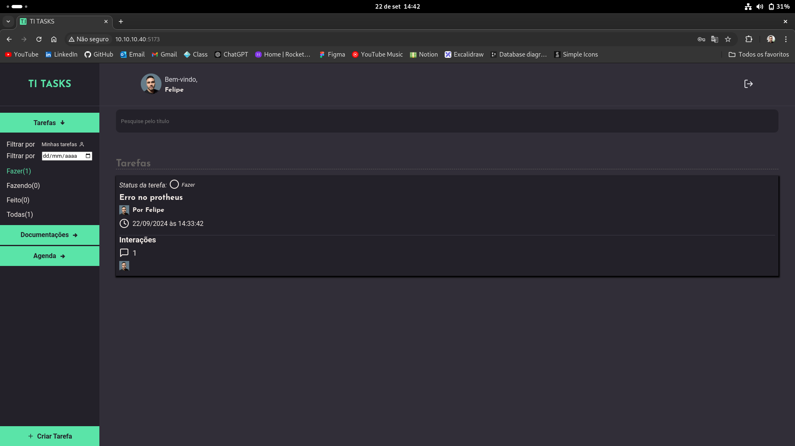|
| Tela Crate | Para criar tasks | 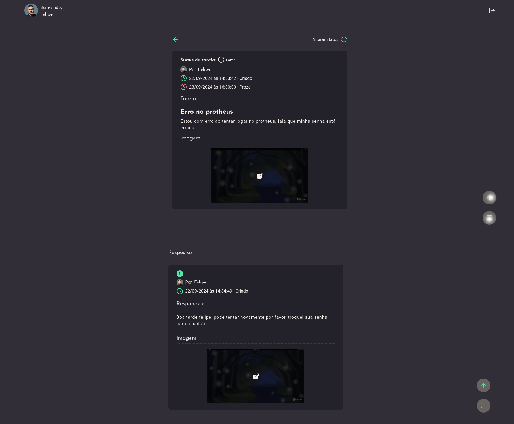|
| Tela Documentations | Onde fica as documentações| 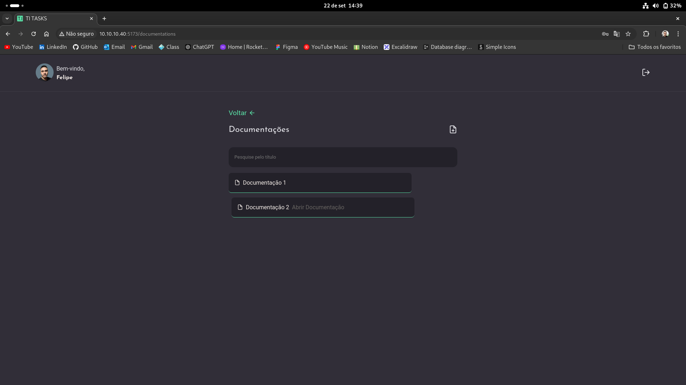|
| Tela Steps | Onde fica os passos da documentação | 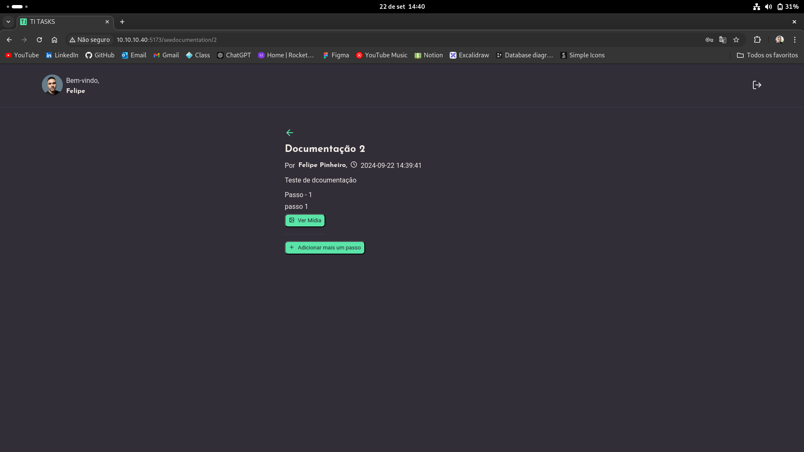|
| Tela schedule | Onde o usuário pode agendar suas reuniões | 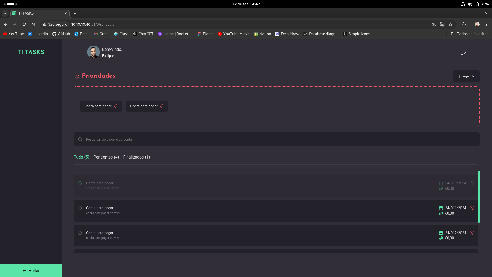|
| Tela Profile | Onde o usuário pode atualizar seus dados | 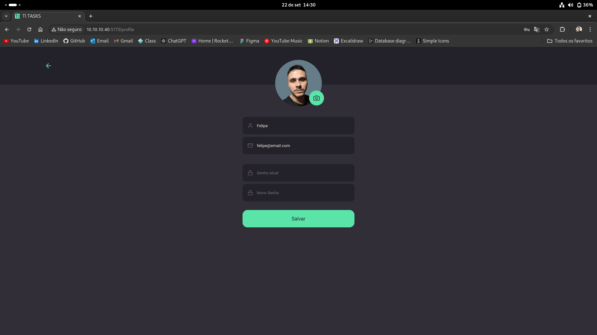|

|MOBILE| MOBILE|
|-----|-------|
|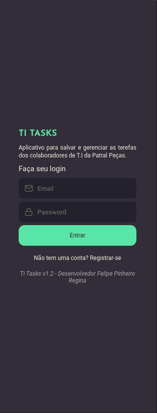|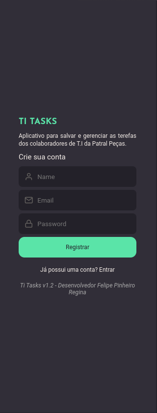|
|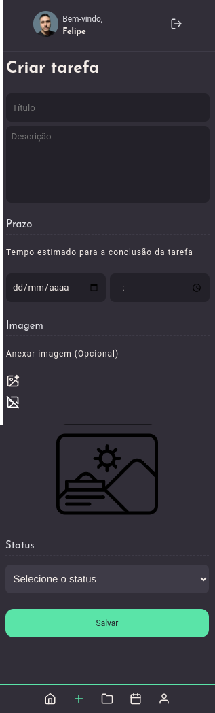|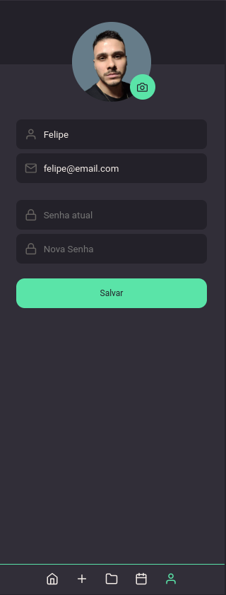|   
|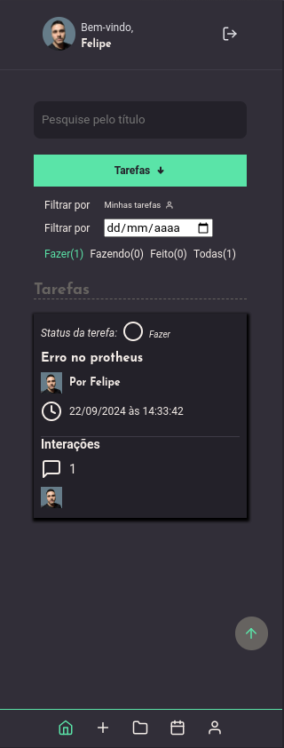|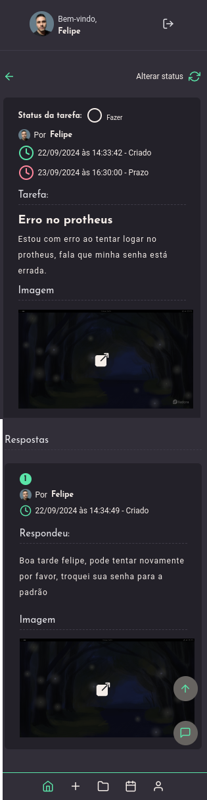|
|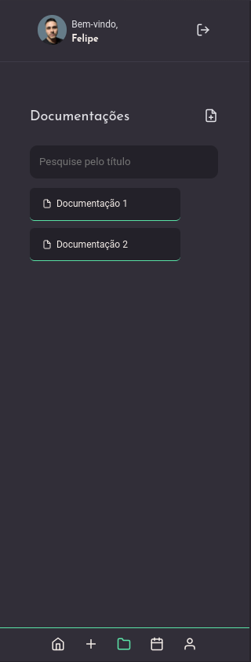|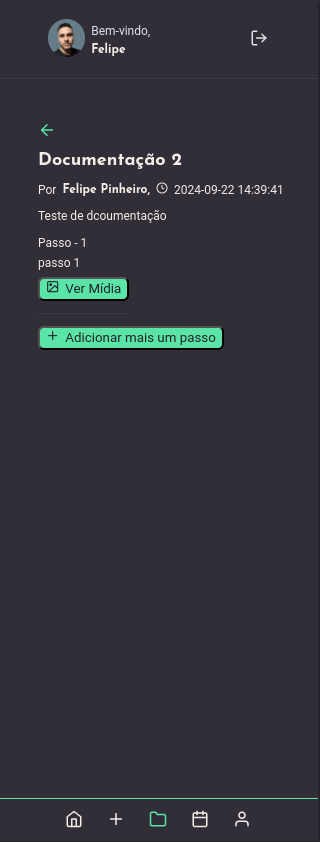| 
|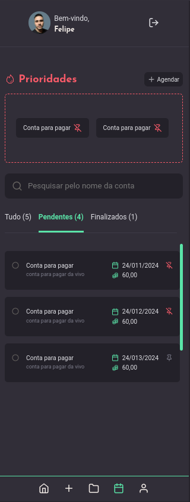||  


<h2>Como rodar a aplicação</h2>

Você primeiro terá que configurar o back-end na sua máquina.

Pegue o ip onde seu backend está escutando e coloque no arquivo `src/services/api.js`

[Back-end da aplicação](https://github.com/FelipePinheiroRegina/frontend-titasks)

```
// bash
cd ~

mkdir projects

git clone https://github.com/FelipePinheiroRegina/frontend-titasks.git

cd frontend-titasks

npm install 

npm run dev // development

npm run build // production
```
<h2 align='center'>Deploy</h2>
O projeto roda em um Ubuntu server na empresa, acessivel apenas para a rede local. utilizei bash para configurar o apache e o firewall.

<h2 align='center'>Desenvolvedor</h2>


<strong>Felipe Pinheiro Regina</strong>

[LinkedIn](https://www.linkedin.com/in/felipe-pinheiro-002427250/)
